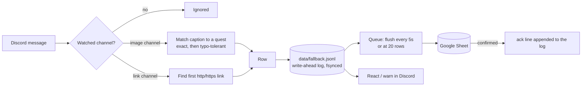

# quest-ledger

A Discord bot that logs community quest submissions (screenshots and links) to a Google Sheet, with a local write-ahead log so nothing is lost.

[](https://github.com/tahabakri/quest-ledger/actions/workflows/ci.yml)

Members link an account ID with `/bind`, then post proof of completed tasks in a channel: a screenshot with a short caption ("daily check-in"), or a link to something they made. quest-ledger turns every submission into a spreadsheet row that a human can review.

## What it is, and what it isn't

**It is a data-capture layer.** It records who submitted what, when and where, matches the caption to a quest type, and flags anything that needs a human look: typos, unrecognised captions, unbound members, IDs claimed by two people.

**It is not a scoring engine.** It does not award points, show leaderboards, reply with scores, or verify that a task really happened. Verification usually needs data the bot can't see (your product's backend, a partner's records), so it is left to the reviewers working from the sheet.

## How it works



1. **A member binds.** `/bind uid:123456` stores their ID against their Discord account (tab `Binds`), always replying ephemerally. Re-binding updates their row. If a different member binds an ID that is already taken, it is still saved but flagged `duplicate_uid = TRUE`.
2. **A member submits.** In an **image channel**, a message with a screenshot is logged, and its caption is matched to a quest keyword. In a **link channel**, any message with a link is logged as that channel's quest type.
3. **Every row is made durable first.** It is appended and fsynced to `data/fallback.jsonl` before the bot reacts, and before any Sheets call. A ✅ therefore always means the row is saved.
4. **Rows reach the sheet in batches.** Once the sheet confirms, an `ack` line goes into the log. Anything never acknowledged is replayed on the next start.

### What the bot does with each message

| Channel | Message | Row logged | Reaction | Reply (auto-deleted) |
|---|---|---|---|---|
| image | screenshot + caption matching a quest | quest type | ✅ | none, or the quest's own `reply` if it has one |
| image | screenshot + caption with a typo | quest type, `fuzzy_match = TRUE` | ✅ | same as above |
| image | screenshot + caption matching nothing | `unmatched`, full text kept | ❓ | "couldn't match this" |
| image | quest caption, no screenshot | none | ❓ | "attach a screenshot" |
| image | chat (no screenshot, no quest) | none | none | none |
| link | contains an http(s) link | the channel's `quest_type` | ✅ | none, or the channel's own `reply` if set |
| link | no link | none | none | none |
| any | author never ran `/bind` | as above, `bound = FALSE` | as above | adds "run /bind first" |

When several warnings apply to one message, they go out as one reply that mentions the member. Threads, including forum posts, count as part of the channel they belong to, and are logged under that channel's name. Bots (including this one), webhooks, system messages, edits, other channels and other servers are ignored.

### Caption matching

Captions and keywords are compared in a canonical form: Unicode-normalised, lower-case, with punctuation, emoji and repeated spaces collapsed. So `**Share-Post** ✅`, `share post` and `SHARE   POST` are the same.

1. **Exact.** The keyword appears anywhere in the caption. Longer keywords are checked first, so a specific keyword always wins over a shorter one it shares words with.
2. **Typo-tolerant.** If nothing matches exactly, each run of caption words is scored against each keyword by [Levenshtein ratio](https://en.wikipedia.org/wiki/Levenshtein_distance): `1 - edits / length of the longer string`. Windows one word shorter or longer than the keyword are scored too, so merged or split words still count. The best score at or above `fuzzy_threshold` (default 0.8) wins; ties go to the longer keyword. Those rows get `fuzzy_match = TRUE`. For example, `done - event attendence ✅` scores 0.94 against `event attendance`.
3. **Specificity guard.** If the exact hit is a keyword contained in a longer keyword (`check-in` inside `daily check-in`), and the caption is a close typo of the longer one (`daly check-in`), the longer one wins, flagged fuzzy. A typo therefore never silently downgrades a submission to a less specific quest.

A keyword marked `strict` skips the typo step and only counts as a whole word. That keeps a short keyword like `join` from matching `joint`, `joined` or `disjoin`. Pair it with a longer, non-strict alias (`join event`) so typos of the full name still match.

Anything that clears none of these is logged as `unmatched` with its full text. Nothing is lost to a typo, and reviewers decide.

### Reliability

- **Write-ahead log.** Every row is appended and fsynced to `DATA_DIR/fallback.jsonl` before any Sheets call. The file is append-only JSON Lines: rows and `ack` lines, never edited in place. A crash can at worst tear the final line, which is skipped on the next start.
- **Batching.** Rows are sent every 5 seconds or as soon as 20 are waiting, one `values.append` per tab. This stays far below the Sheets write quota during launch-day bursts.
- **Retries.** A failed batch is retried after 1s, 4s and 16s. If Sheets is still down, the rows stay queued (and in the log). The writer pauses for 30 seconds to 5 minutes, then tries again. Nothing is dropped, and the bot keeps accepting submissions.
- **No duplicates on replay.** A Sheets call that errors may still have been applied. So rows from a failed attempt, and rows restored from the log at startup, are first checked against the sheet's `message_link` column. Binds are upserts keyed by Discord user ID, so repeating one is harmless.
- **Cached binds.** Submissions look up the member's ID in memory, never in the sheet. The cache is updated by `/bind` itself, loaded from the sheet at startup, and refreshed every `binds_refresh_minutes` to pick up manual edits. If the sheet is unreachable, it is rebuilt from the log.
- **Isolation.** Every handler is wrapped in error handling, so one bad message never takes the bot down. Reaction and reply failures never affect the row. If the log itself can't be written, the row is printed to the host logs for manual recovery, and no ✅ is shown.
- **Safe cells.** Values are written `RAW`. A caption such as `=IMPORTXML(...)` stays text instead of becoming a live formula in your reviewers' sheet, and long IDs are never rounded to floats.
- **One writer.** A lock file in `DATA_DIR` stops two copies of the bot, or the bot and `npm run replay`, from writing the same log.

## The sheet

Point the bot at any spreadsheet shared with its service account. It creates the two tabs, if missing, with these headers in row 1. The headers are re-checked before every batch:

- **Different headers**, for example a column inserted in the middle: the bot stops writing rather than put values under the wrong columns. Submissions keep landing in the log, and writing resumes once the sheet is fixed.
- **A deleted tab:** it is recreated.

You can add your own review columns to the right of these.

**`Binds`**, one row per member:

| Column | Header | Example | Notes |
|---|---|---|---|
| A | `timestamp_utc` | 2026-01-15T09:00:00Z | First bind, ISO 8601 UTC |
| B | `discord_user_id` | 100000000000000001 | Stable Discord ID |
| C | `discord_username` | member_one | Username at the latest bind |
| D | `uid` | 123456789 | The bound ID |
| E | `duplicate_uid` | FALSE | TRUE if the ID was already bound to a different member |
| F | `last_updated_utc` | 2026-01-15T09:00:00Z | Latest bind |

**`Submissions`**, one row per submission:

| Column | Header | Example | Notes |
|---|---|---|---|
| A | `timestamp_utc` | 2026-01-15T10:00:00Z | When the message was posted |
| B | `discord_user_id` | 100000000000000001 | |
| C | `discord_username` | member_one | |
| D | `uid` | 123456789 | From the bind cache; blank if unbound |
| E | `bound` | TRUE | FALSE if the member hadn't run `/bind` |
| F | `quest_type` | daily_check_in | A quest type, a link channel's type, or `unmatched` |
| G | `fuzzy_match` | FALSE | TRUE for typo matches |
| H | `channel_name` | submissions | |
| I | `message_text` | Daily check-in done ✅ | Full raw text |
| J | `attachment_url` | https://cdn.discordapp.com/... | First image; blank in link channels |
| K | `link_url` | https://example.com/post/1 | First link; blank if none |
| L | `message_link` | https://discord.com/channels/... | Jump link to the message; also the dedupe key |
| M | `date_utc` | 2026-01-15 | Date only, handy for daily caps |

> **Screenshot links expire.** Discord signs attachment URLs, and they stop working after about a day. Reviewers should open the `message_link` instead: it jumps to the message, where the screenshot always loads, as long as the message hasn't been deleted.

## Setup

You need Node.js 22.12 or newer, a Discord server you manage, and a Google account.

### 1. Discord application

1. Open the [Discord Developer Portal](https://discord.com/developers/applications) and click **New Application**.
2. **Bot** tab: click **Reset Token** and copy the token into `DISCORD_BOT_TOKEN`. It is a password; never commit it.
3. **Bot** tab, **Privileged Gateway Intents**: enable **Message Content Intent**. Without it the bot can't read captions, and it will exit at startup telling you so. Server Members and Presence intents are not needed.
4. **OAuth2 > URL Generator**: tick the scopes `bot` and `applications.commands`, then these bot permissions:
   - View Channels
   - Send Messages
   - Send Messages in Threads
   - Add Reactions
   - Read Message History (needed to react to and reply to messages)

   Manage Messages is not needed: the bot only deletes its own replies. The resulting URL looks like `https://discord.com/oauth2/authorize?client_id=<APPLICATION_ID>&scope=bot+applications.commands&permissions=274877975616`.
5. Open the URL and add the bot to your server. Make sure it can see the channels you will watch.
6. In Discord, enable **User Settings > Advanced > Developer Mode**. Then right-click the server to copy `GUILD_ID`, and right-click each channel to copy its ID for the config.

At startup the bot registers `/bind` as a server command in `GUILD_ID`, so it appears immediately. It also logs a line for each watched channel: either `watching #name`, or the reason it can't (the channel wasn't found, or a named permission is missing).

### 2. Google service account

1. In the [Google Cloud Console](https://console.cloud.google.com/), create a project (or pick one) and enable the **Google Sheets API** under **APIs & Services > Library**.
2. Go to **IAM & Admin > Service Accounts > Create service account**. No roles are needed.
3. Open the account, then **Keys > Add key > Create new key > JSON**, and download it. Keep it private (`service-account*.json` is gitignored).
4. Create a Google Sheet. Click **Share** and add the service account's email (`name@project.iam.gserviceaccount.com`) as **Editor**.
5. Copy the spreadsheet ID, the part of the URL between `/d/` and `/edit`, into `GOOGLE_SHEET_ID`. The full URL works too.

If your Google Workspace blocks service-account key creation, an administrator has to allow it, or you can use a project under a personal account.

### 3. Configure and run locally

```bash
git clone https://github.com/tahabakri/quest-ledger.git
cd quest-ledger
npm ci
cp .env.example .env              # fill in the Discord and Google values
cp config.example.yml config.yml  # set your quests, channels and wording
npm run dev
```

The first start creates the sheet tabs, registers `/bind`, and logs `connected to Discord`.

## Configuration

Everything deployment-specific lives in `config.yml`, which is gitignored. [`config.example.yml`](config.example.yml) is a commented template. On hosts without file mounts, put the whole YAML document in the `CONFIG_YAML` environment variable instead; it wins over the file. Any string value may reference an environment variable as `${NAME}`. The config is validated at startup: a typo, a missing field or a bad value stops the bot with a message naming every problem.

| Key | Default | Meaning |
|---|---|---|
| `quests` | required | List of `{ keyword, type, strict?, reply? }`. `reply` is posted, mentioning the member, when a submission is logged as that quest (typo matches included); it joins any warning in one message, and one quest type has one wording. `type` is what lands in `quest_type`. Several keywords may share one type (aliases). Keywords must stay distinct after normalisation; `unmatched` is reserved. `strict: true` matches the keyword only as a whole word, with no typo tolerance: use it for short keywords such as `join`, which would otherwise match inside `joint`. |
| `fuzzy_threshold` | `0.8` | Minimum Levenshtein ratio for a typo match, `0 < t <= 1`. `1` disables typo matching. |
| `bind.command` | `bind` | Slash command name. |
| `bind.command_description` | required | Shown in Discord's command picker. |
| `bind.id_label` | required | The option members fill in, e.g. `uid` for `/bind uid:123456`. Lowercase. |
| `bind.id_description` | required | Help text for that option. |
| `bind.id_pattern` | `^\d{6,15}$` | Regular expression a valid ID must match. The value is trimmed first; full-width, Arabic-Indic and Persian digits count as digits. |
| `bind.replies.success` / `.invalid` / `.error` | success and invalid required | Ephemeral replies to `/bind`. |
| `channels` | required | List of `{ id, mode: image }` or `{ id, mode: link, quest_type, reply? }`. |
| `replies.unmatched` / `.no_image` / `.unbound` | required | Warnings posted in the channel, mentioning the member. |
| `reactions.success` / `.attention` | `✅` / `❓` | Unicode emoji, or a custom emoji as `<:name:id>`. |
| `warning_delete_after_seconds` | `60` | Warnings and quest replies are deleted after this long. `0` keeps them. |
| `image_extensions` | `[png, jpg, jpeg, gif, webp]` | Attachment types that count as a screenshot. |
| `sheets.binds_tab` / `.submissions_tab` | `Binds` / `Submissions` | Tab names. |
| `sheets.flush_interval_seconds` | `5` | Send queued rows at least this often... |
| `sheets.flush_max_rows` | `20` | ...or as soon as this many are waiting. |
| `sheets.binds_refresh_minutes` | `10` | How often to re-read the Binds tab for manual edits. `0` = never. |

### Environment variables

| Variable | Required | Meaning |
|---|---|---|
| `DISCORD_BOT_TOKEN` | yes | Bot token from the Developer Portal. |
| `GUILD_ID` | yes | The server the bot serves. |
| `GOOGLE_SHEET_ID` | yes | Spreadsheet ID or URL. |
| `GOOGLE_SERVICE_ACCOUNT_JSON` | yes | The key JSON itself (on one line, unquoted, in a `.env` file) or a path to the key file. |
| `DATA_DIR` | no, default `data` | Where the write-ahead log lives. **Must be persistent storage in production.** |
| `CONFIG_PATH` | no, default `config.yml` | Config file location. |
| `CONFIG_YAML` | no | The whole config as YAML; overrides the file. |
| `LOG_LEVEL` | no, default `info` | `debug`, `info`, `warn` or `error`. |
| anything your config references | if referenced | e.g. `SUBMISSIONS_CHANNEL_ID`. |

## Deploying as a worker

quest-ledger is a long-running worker: it serves no HTTP and needs no public URL. Any host that keeps a Node 22+ process running, restarts it on crash, and gives it **persistent disk** will do.

**The persistent disk is not optional.** The write-ahead log is what makes a Sheets outage or a crash survivable. On hosts with ephemeral filesystems, Railway included, a redeploy wipes the container's disk. Rows that were accepted but not yet written would be lost with it. Put `DATA_DIR` on a mounted volume.

### Railway

1. **New Project > Deploy from GitHub repo**, and pick your fork. Railway's builder detects Node (version from `engines`), installs dependencies, runs `npm run build`, and starts with `npm start`.
2. **Add a volume** to the service, mounted at `/data`.
3. **Variables:** set `DISCORD_BOT_TOKEN`, `GUILD_ID`, `GOOGLE_SHEET_ID`, `GOOGLE_SERVICE_ACCOUNT_JSON` (paste the key JSON), `CONFIG_YAML` (paste your config), `DATA_DIR=/data`, and any variables your config references.
4. **Settings:** don't generate a domain. The default restart policy (On Failure) restarts the bot after a crash; on paid plans you can raise its 10-restart limit. Replicas can't be combined with volumes, which suits the bot: two copies would log every message twice.
5. **Deploy**, then watch the logs for `connected to Discord` and `registered /bind`.

With a volume attached, Railway stops the old deployment before starting the new one, so every redeploy has a short gap. Discord doesn't replay messages sent while the bot is offline. Those messages get no ✅, so members can see they need to post again. Deploy during quiet hours.

### Other hosts

On a VPS, run `npm ci && npm run build`, then keep `npm start` alive with systemd (`Restart=on-failure`), pm2 or similar, with `DATA_DIR` on a normal disk. Send `SIGTERM` to stop: the bot deletes outstanding warnings, makes one last attempt to write queued rows, and exits.

## Replaying the log

The bot replays automatically: on every start, rows the log never saw acknowledged are checked against the sheet and written if missing. Restarting the bot is therefore the usual fix after an outage.

To replay by hand, for example from a copy of the log on another machine:

```bash
npm run build
npm run replay -- --dry-run                       # list what would be written
npm run replay                                    # write it
npm run replay -- --file ./backup/fallback.jsonl  # replay another copy
```

Stop the bot first. The data-dir lock refuses to replay while a bot on the same machine is running, because two writers would duplicate rows. Replay exits non-zero if anything is left unwritten, so you can rerun it once Sheets is reachable.

`fallback.jsonl` is plain JSON Lines, one object per line: a `row` line (keys match the sheet headers) or an `ack` line listing the row IDs that reached the sheet. You can also inspect it with `jq`, or import it by hand.

## Development

```bash
npm run dev        # run from source, restart on change
npm test           # unit tests (Vitest)
npm run lint       # ESLint, type-aware
npm run typecheck  # tsc --noEmit
npm run build      # compile to dist/
```

```
src/
  index.ts                  wiring: config, log, writer, Discord client, shutdown
  config.ts                 zod schema, CONFIG_YAML / file loading, ${VAR} interpolation
  env.ts                    environment variables and service-account parsing
  matcher.ts                caption normalisation, exact and fuzzy quest matching
  submissions.ts            per-message decision table, row building, link and image detection
  binds.ts                  in-memory bind cache and duplicate detection
  wal.ts                    append-only write-ahead log
  writer.ts                 batching, retries, dedupe, bind upserts
  lock.ts                   data-dir lock
  replay.ts                 npm run replay
  sheets/                   column schema and the Google Sheets gateway
  discord/                  /bind command and message handler
test/                       Vitest suites, with an in-memory fake sheet
```

## License

[MIT](LICENSE) © Taha Bakri
